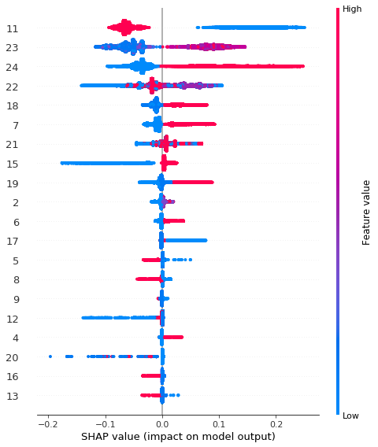
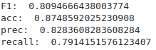
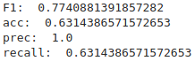

# Covid-19 classifier from Brazil's SRAG data

#### Machine Leaning Engineering Capstone Project Report - Pedro Tavares de Carvalho

ℹ️ *All of the datasets and info for this construction are in Brazilian Portuguese.*

## I - Definition

COVID-19 information is spreading quickly, from multiple sources, fact, and fiction alike. From amazing data tracking by [Worldometers](https://www.worldometers.info/coronavirus/) to misleading information regarding drugs and vaccines, the range of reliability in data is very wide.

Brazil is not out of the woods yet with cases of COVID- 19 infections still rising. Unfortunately, Brazil is also in a way the epicenter of misinformation and data occlusion.

Currently going through difficult times with multiple crises springing up in the political, health, and economic sectors, there are two major factors that have fueled numerous crises in Brazil. The first, insufficient availability of valid, credible data from reliable sources and the second, overwhelming availability of misleading information and data.

Despite the grim state of information circulation in Brazil, there is light at the end of the tunnel with the [OpenDataSUS](https://opendatasus.saude.gov.br/) [SRAG (SARS for the non-Portuguese speakers) datasets](https://opendatasus.saude.gov.br/dataset/bd-srag-2020). OpenDataSUS is a governmental effort to provide easy access to data regarding the Unified Health System (Sistema Único de Saúde in Portuguese) researches and aggregated information.

These datasets contain information on patients hospitalized due to SRAG symptoms from every year since 2013, they also provide information on patients who were diagnosed with COVID-19, or other diseases. Information relating to patients with inconclusive diagnostic results are also presented. An inquirer may question whether or not a patient was correctly diagnosed from available information.

These datasets were actually very well documented and organized, containing a description for what each column meant and the actual name of the column, all well described in a [PDF file](https://opendatasus.saude.gov.br/dataset/9bc2013f-f293-4f3e-94e7-fa76204fc035/resource/20e51b77-b129-4fd5-84f6-e9428ab5e286/download/dicionario_de_dados_srag_hospitalizado_atual-sivepgripe.pdf). (all the information is in Portuguese, but it’s pretty easily translated via Google).

Based on the data, I wanted to try and build a classifier for the cases (since almost half of the cases are actually unidentified). The classifier will be evaluated via four metrics:

- accuracy 
  - number of correct guesses divided by the number of samples
- precision
  - number of true positive guesses divided by the number of all positive guesses
- recall
  - number of true positive guesses divided by the number of all positive samples
- F1
  - the harmonic mean of the precision and recall

These metrics give a good idea of the performance of the model in most situations, concerning if it needs to never predict a false positive or a false negative, and the balancing of these situations.

To build the classifier, I went through a few steps, the first one of which was **The Exploration.**

> ℹ️ All code is contained [in this GitHub repository](https://github.com/ptcar2009/covid19-classifier).

## II - Analysis

I split the data into two types of data:

- Pre-COVID (which contained data from every year before 2020)
- Post-COVID (which contained data from 2020 onwards)

The first official case in Brazil was registered in February 2020, funny thing is that the first SRAG official case diagnosed as COVID-19 was actually reported in early 2019, but that’s probably a reporting mistake, or a data processing one.

To solve that, I downloaded the data with a little bash magic

Getting data from the OpenDataSUS sources.

This script has to handle a little weird thing because the link for the 2020 data is constantly updated as new data arrives, so I handled that with **grep** and **awk**.

After downloading everything, it was time to do some data exploration and processing.

The first step was to consume the data into the data frames, and this was done through pandas and CSV reading.

### Data Exploration

The first thing I did was validate the conjecture that a lot of the data was actually classified as unknown causes, and these graphics strongly point to it:

<iframe width="900" height="800" frameborder="0" scrolling="no" src="//plotly.com/~ptecodev/1.embed"></iframe>

The massive amount of COVID after 2020 is not a surprise here, but the massive amount of unidentified shows pretty clearly that some numbers are misrepresented in the current data.

<iframe width="900" height="800" frameborder="0" scrolling="no" src="//plotly.com/~ptecodev/8.embed"></iframe>

As you can see, the cases in the first half of 2020 are comparable to the total number of cases from 2014 to 2019, which shows an increase that doesn’t seem likely to occur naturally.

This increase in unknown causes can also be seen in a time plot of the total number in 2020.

<iframe width="900" height="800" frameborder="0" scrolling="no" src="//plotly.com/~ptecodev/10.embed"></iframe>

This graph clearly shows an immense increase in cases considered unknown in a similar fashion to the ones considered COVID.

## Column Checking

The next step in the exploration phase is to try and identify utility midst chaos in the provided SARS data. Most of the columns describe either useless data regarding the subject of the registration (like the name of the patient, the identification number of the registration, or details regarding the diagnosis).

The columns that I considered useful are as follow:

- SG_UF_NOT -> This column identifies the Federal Unity (or state) where the patient was registered. This is useful mostly because the social background of each Brazilian state can differ hugely, and this can affect the treatment and exposure of the patient both to COVID-19 and to better health care.
- CS_SEXO -> This is the sex of the patient. Although COVID isn’t the most misogynistic virus, it still has some biases.
- CS_RACA -> This describes the ethnicity of the subject.
- SURTO_SG, NOSOCOMIAL, FEBRE, TOSSE, GARGANTA, DISPNEIA, DESC_RESP, SATURACAO, DIARREIA, VOMITO, OUTRO_SIN -> These columns describe some basic diagnostic factors (symptoms like cough and fever, and environmental hazards, like the kind of work).
- PUERPERA, CARDIOPATI, HEMATOLOGI, SIND_DOWN, HEPATICA, ASMA, DIABETES, NEUROLOGIC, PNEUMOPATI, RENAL, OBESIDADE -> These define risk factors.
- VACINA -> This states if the patient was vaccinated for the flu.
- ANTIVIRAL, TP_ANTIVIR -> This states if the patient used any antiviral medicine.
- HOSPITAL -> This describes if the patient was sent to a hospital.
- UTI -> This states if the patient was held in an ICU.
- SUPORT_VEN -> This states if the patient used respiratory support.
- RAIOX_RES -> This states the result of the chest X-ray exam.
- AMOSTRA, TP_AMOSTRA -> This states if the patient collected samples for the diagnosis, and what kind of sample was collected.
- EVOLUCAO -> This states what was the evolution of the case if the patient died or was cured.
- ID_MN_RESI or CO_MUN_RES -> this identifies the city where the patient resides

After deciding the base columns, I did an extensive research on the distribution of the column values, through box blots, which tell us about the limits and ranges of the data, and histograms, so that we can get take a look on the distribution of the data.

Most of the columns were pretty balanced between the datasets, but they also contained a lot of either ignored or not added values, which made me drop all the `nan` values in each dataset. This decreased the number of samples I had from about 500k to about 100k on each section (pre and post 2020), but it should make the model more reliable.

# The Processing

To process the data, there were some easy steps, and some steps that asked for some deeper thinking.

All the processing was done in this function below:

After processing the data, I trained some base models just to take a look at the end result, and applied the `SHAP` library to it. SHAP is a library that uses the [Shapley value](https://en.wikipedia.org/wiki/Shapley_value) and some related work, which are game theory means of obtaining some explanation behind the model's workings. The first SHAP I ran gave me this result.

The numbers on the right of the plot represent each feature of the dataset. The feature number 27 is actually the state from which the report was taken. This clicked on me, because the distribution of the COVID cases in Brazil is not homogeneous at all, most of the cases were concentrated within the southeast region, and the hospitals and reporting are better there too.

This can be seen by this distribution:

<iframe width="900" height="800" frameborder="0" scrolling="no" src="//plotly.com/~ptecodev/43.embed"></iframe>

It's easy to see that the number of cases in SP would cause a huge bias in the model, since the distribution of cases in the negative labels is pretty different.

<iframe width="900" height="800" frameborder="0" scrolling="no" src="//plotly.com/~ptecodev/45.embed"></iframe>

This caused my model to predict that everyone from SP and RJ were positive for COVID, which was a bad bias considering the objective of the model is to predict not by circumstance, but by symptoms and pre-existing conditions. This information made me take out the state from the feature set, and to take out some other features that didn't seem relevant due to the number of ignored or `nan` values.

After these changes, the SHAP model I got hand very different predictive features, most of which were not seasonal at all, and seemed to be symptomatic or related to x-ray results.

The feature 11 is CARDIOPATI, and it's values are pretty balanced overall, and feature 23 is the x-ray results, which seem to be pretty relevant both in statistical and medical spectrums.

Finally, we go on to the construction of **The Model**.

# The Model

To build the model, I needed to clarify what my training and testing datasets would be. You see, this specific data is weird because the labeling is not consistent through time.

The data is divided into three main categories.

For the Pre 2020 category, all data is definitely not COVID. Even the unknown causes data. As for the 2020 data, all positive data is classified clinically, so we can be sure that it’s positive, in the exam sense. Meanwhile, the Post 2020 negative data is, as we’ve demonstrated, a bit iffy. The labeling is not trustworthy and it probably wouldn't help the model in any way.

Considering that, I made a choice to divide the training code in these two labels:

- Pre 2020, as the negative
- Post 2020 positive, as the positive

and train a binomial classifier based on these labels.

This choice can cause some biases if the distribution of this data has changed in ways other than the symptomatic, but, given the macrostructure of the data, it’s the best solution I could think of.

Moving on, we get to the model

## XGBoost

The current state of the art for tabular classification ranges in a few algorithms, and XGBoost is one that is close to the state of the art. There are some others, like the [FastAI tabular](https://docs.fast.ai/tabular.html) algorithm, [random forests](https://www.stat.berkeley.edu/~breiman/RandomForests/cc_home.htm), and others, but XGBoost is among the best, and its implementation is simple and reliable, being contained in the SageMaker default library.

XGBoost is an algorithm based on [gradient boosting]([https://en.wikipedia.org/wiki/Gradient_boosting#:~:text=Gradient%20boosting%20is%20a%20machine,prediction%20models%2C%20typically%20decision%20trees.](https://en.wikipedia.org/wiki/Gradient_boosting#:~:text=Gradient boosting is a machine,prediction models%2C typically decision trees.)), which is a technique based on combining several 'weak' classification models into a strong classifier, with help of gradient descent for choice of weaker models in a function focused manner. XGBoost is not the only gradient boosting algorithm, but it's the most used and most reliable, being it open source and on development and usage since 2006.

There are many hyper-parameters in the XGBoost model, but the most important ones are the `eda`, which defines the rate that the trees are optimized via the gradient descent, the `max_depth` and the `subsample`, both of which define characteristics of the underlying weaker model (in this case a tree classifier), and they control most of the overfitting and complexity of the model.

To optimize these hyper-parameters, I used SageMaker's hyperparameter tuning tools, which make it easy to search a diverse range of training parameters and use the best performing one.

After optimizing, I used the best training job as a parameter for testing and evaluating.

This model gave out some interesting results. In the training process, the model achieved incredibly good metrics, with accuracy near perfect.

These metrics had some pretty good results, considering that the data was not the best, with many unusable values and not much information overall, regarding symptoms and other conditions.

From this point, I had built a COVID-19 classifier from SRAG data. But I wanted to benchmark this classifier against the cases from 2020 which were classified as Unknown Causes, to see if the model was compatible with studies [from earlier this year](https://oglobo.globo.com/sociedade/coronavirus/alem-da-covid-19-brasil-tem-outras-2771-mortes-por-problemas-respiratorios-sem-explicacao-24389276) that state how many cases of COVID-19 were hidden in the unknown causes.

To do that, I first made the same processing from before in the Post 2020 positive cases, then ran the same metrics, but considering the whole data as positive, to get a grasp for how many cases my model would classify as COVID, from the unknown causes.

From this test, I got about 63% accuracy, meant that my model predicted that about 60% of the cases classified as unknown causes were actually COVID. This is a good prediction in relation to the benchmark statistical value from the article. 

# Conclusion

The model gave good predictions overall, and with some more feature manipulation and engineering, aswell as cross referencing data from other sources, like population density and hospital resources, this method seems to be promising on classifying whether or not a given case is or isn't COVID, both from the accuracy of the model itself on it's training dataset and from the Unknown Cases cases, on which the model gave results pretty similar to the statistical benchmark. 

There are a bunch of other datasets regarding COVID-19 in Brazil, and they’re mostly unexplored in a machine learning environment. This project gave me the opportunity to see for myself what can be done, and I intend to keep digging and improving the models.